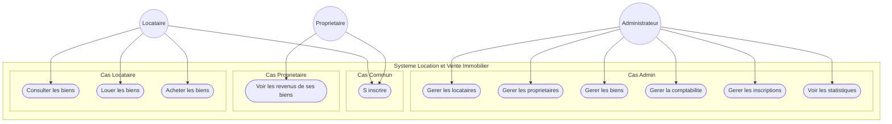

```mermaid
graph TD
    %% ===== ACTEURS A GAUCHE =====
    ADMIN(("Administrateur"))
    PROPRIO(("Proprietaire"))
    LOCATAIRE(("Locataire"))

    %% ===== SYSTEME =====
    subgraph SYSTEME["Systeme Location et Vente Immobilier"]
        direction LR

        subgraph ADM["Cas Admin"]
            direction TB
            UC01(["Gerer les locataires"])
            UC02(["Gerer les proprietaires"])
            UC03(["Gerer les biens"])
            UC04(["Gerer la comptabilite"])
            UC05(["Gerer les inscriptions"])
            UC06(["Voir les statistiques"])
        end

        subgraph COMMUN["Cas Commun"]
            direction TB
            UC07(["S inscrire"])
        end

        subgraph PROP["Cas Proprietaire"]
            direction TB
            UC08(["Voir les revenus de ses biens"])
        end

        subgraph LOC["Cas Locataire"]
            direction TB
            UC09(["Consulter les biens"])
            UC10(["Louer les biens"])
            UC11(["Acheter les biens"])
        end
    end

    %% ===== LIENS ADMINISTRATEUR =====
    ADMIN --> UC01
    ADMIN --> UC02
    ADMIN --> UC03
    ADMIN --> UC04
    ADMIN --> UC05
    ADMIN --> UC06

    %% ===== LIENS PROPRIETAIRE =====
    PROPRIO --> UC07
    PROPRIO --> UC08

    %% ===== LIENS LOCATAIRE =====
    LOCATAIRE --> UC07
    LOCATAIRE --> UC09
    LOCATAIRE --> UC10
    LOCATAIRE --> UC11
```

